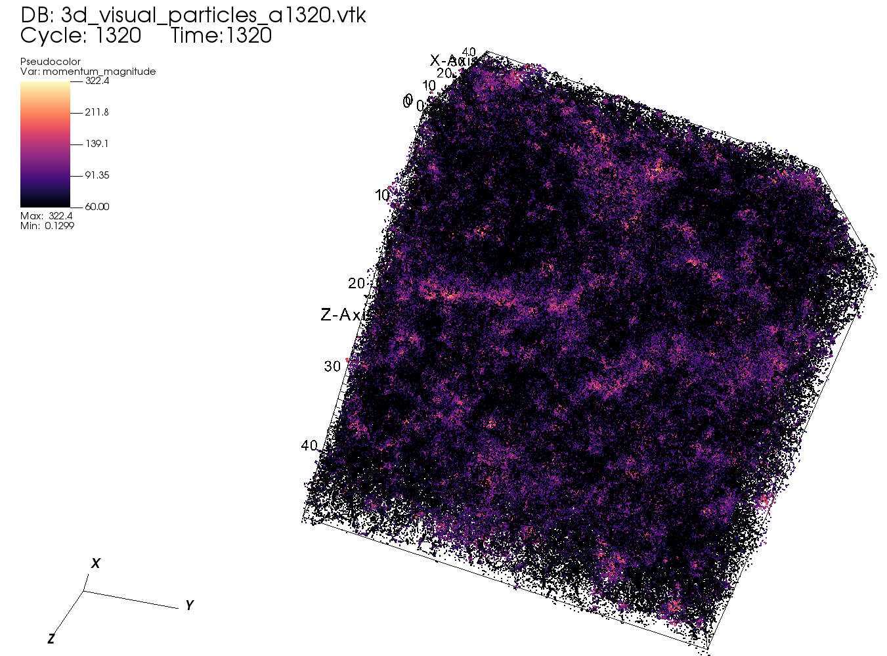
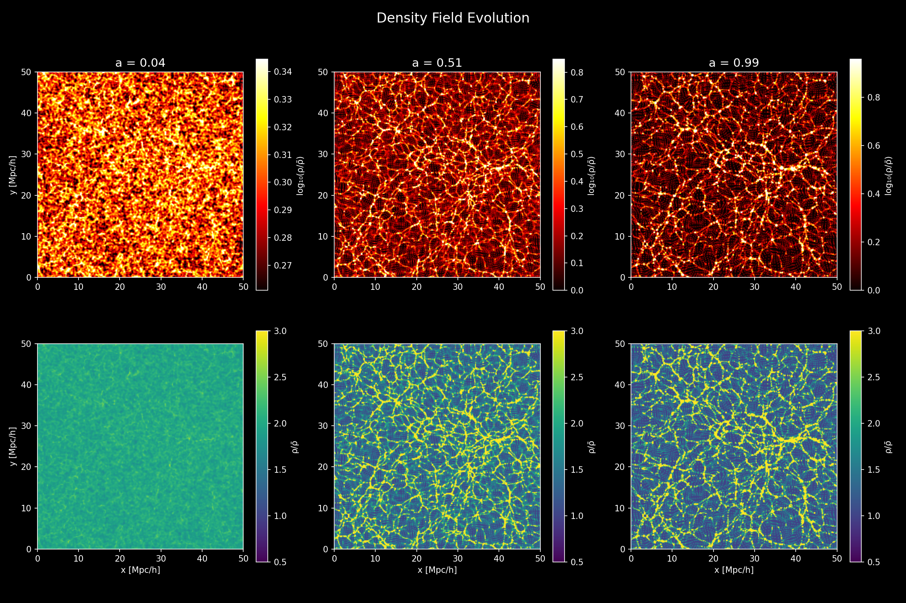

# P3M-JAX: Cosmological N-Body Simulation

# Ashwin Shirke



Reference config: `configs/3d_visual.json`.
Model used: flat LambdaCDM-like cosmology with `H0 = 70.0`, `OmegaM = 0.6`, `OmegaL = 0.4` (matter-rich expansion history).

A JAX-accelerated, dimension-agnostic Particle-Particle-Particle-Mesh (P3M) N-body code for cosmological simulations. Supports 2D and 3D domains, pure PM and full P3M force computation, and fixed or CFL-adaptive time-stepping — all controlled by a single JSON config file.

Runs without modification on CPU, NVIDIA GPU, and Apple Silicon.

---

## Project Structure

```
P3M_JAX/
├── main.py                     # Entry point
├── configs/                    # JSON simulation configs
│   ├── default.json            # 2D EdS, N=128, float64, PM, fixed dt
│   ├── high_res.json           # 2D LCDM, N=256, float32, PM, fixed dt
│   ├── 3d_default.json         # 3D EdS, N=64, float32, PM, fixed dt
│   ├── 3d_heigh_res.json       # 3D LCDM, N=128, float32, PM, fixed dt
│   ├── 3d_heigh_res_p3m.json   # 3D LCDM, N=128, float32, P3M, fixed dt
│   └── p3m_adaptive.json       # 2D EdS, N=64, P3M + adaptive dt
├── src/
│   ├── core/                   # JAX kernels: CIC, interpolation, GRFs, filters
│   ├── physics/                # Cosmology, PoissonVlasov system, Zeldovich ICs
│   ├── solver/                 # State, KDK leapfrog, lax.scan / while_loop
│   └── utils/                  # Power spectrum, VTK I/O
├── tests/                      # 54 unit and physics tests
└── results/                    # Auto-created; outputs organised by config name
```

---

## Installation

Requires Python 3.9+.

```bash
# Using Make (recommended)
make setup

# Or manually
pip install -r requirements.txt
```

---

## Running Simulations

```bash
python main.py --config configs/default.json
```

### Available Configurations

| Config | dim | N | Solver | Stepping | Precision |
|--------|-----|---|--------|----------|-----------|
| `default.json` | 2 | 128 | PM | fixed dt=0.02 | float64 |
| `high_res.json` | 2 | 256 | PM | fixed dt=0.015 | float32 |
| `3d_default.json` | 3 | 64 | PM | fixed dt=0.02 | float32 |
| `3d_heigh_res.json` | 3 | 128 | PM | fixed dt=0.02 | float32 |
| `3d_heigh_res_p3m.json` | 3 | 128 | P3M | fixed dt=0.02 | float32 |
| `p3m_adaptive.json` | 2 | 64 | P3M | adaptive (CFL) | float64 |

---

## Config Parameters

```json
{
  "dim": 2,              // spatial dimension: 2 or 3
  "N": 128,              // particles per side (N^dim total)
  "L": 50.0,             // box side length [Mpc/h]
  "A": 10.0,             // initial displacement amplitude
  "seed": 4,             // random seed
  "a_start": 0.02,       // initial scale factor
  "a_end": 1.0,          // final scale factor
  "power_index": -0.5,   // primordial spectral index n_s
  "H0": 70.0,            // Hubble constant [km/s/Mpc]
  "OmegaM": 1.0,         // matter density parameter
  "OmegaL": 0.0,         // cosmological constant
  "precision": "float64", // "float16" | "float32" | "float64"

  // --- Force solver ---
  "solver": "pm",        // "pm" | "p3m"
  "pp_window": 4,        // P3M: sliding window half-width
  "pp_softening": 0.2,   // P3M: gravitational softening length [Mpc/h]
  "pp_cutoff": 2.5,      // P3M: PP cutoff in units of force grid cell size

  // --- Fixed time-stepping ---
  "dt": 0.02,            // fixed Δa step
  "save_every": 1,       // leapfrog steps between saved snapshots

  // --- Adaptive time-stepping ---
  "timestepping": "fixed", // "fixed" | "adaptive"
  "C_cfl": 0.3,           // CFL safety factor
  "dt_min": 0.001,        // minimum Δa
  "dt_max": 0.05,         // maximum Δa
  "n_chunks": 50,         // number of output checkpoints

  // --- Output ---
  "save_vtk": true,
  "vtk_freq": 1,
  "save_power_spectrum": true
}
```

### Precision

| Value | x64 enabled | Use case |
|-------|-------------|----------|
| `"float64"` | yes | Default; required for accurate gravitational potentials |
| `"float32"` | no | Faster on GPU/MPS; ~2× memory reduction |
| `"float16"` | no | Experimental; numerically unstable |

---

## Output

All output is written to `results/<config_name>/`:

```
results/default/
├── density_evolution.png       # density map at early/mid/late times
├── particle_evolution.png      # particle scatter plot
├── power_spectrum.csv          # P(k) at every saved timestep
├── power_spectrum.png          # P(k) evolution coloured by scale factor
└── vtk/
    ├── particles/              # Binary VTK PolyData (positions + momenta)
    └── density/                # ASCII VTK StructuredPoints (density field)
```

VTK files are compatible with ParaView 5.x+.

---

## Running Tests

```bash
pytest tests/ -v
```

54 tests cover CIC mass conservation, interpolation accuracy, Box wave numbers, gradient correctness, PM/P3M force computation, erfc force splitting, Morton Z-curve ordering, and adaptive time-step bounds.

---

## Method Summary

**Force computation (PM mode):** Cloud-in-Cell (CIC) mass deposition onto a dual-resolution grid (force grid at 2× the mass grid resolution), FFT Poisson solve with a precomputed potential kernel, second-order finite-difference gradient, and bilinear/trilinear interpolation back to particle positions.

**Force computation (P3M mode):** PM long-range force augmented by a direct particle-particle short-range correction. Particles are sorted along a Morton Z-curve; a sliding window of width `2*pp_window+1` cells accumulates PP forces using an erfc force-splitting kernel that removes the PM contribution below `pp_cutoff` cell widths.

**Initial conditions:** Zeldovich approximation from a Gaussian random potential field with power spectrum P(k) ∝ k^n_s, tapered by a Gaussian scale filter and Nyquist cutoff.

**Time integration:** KDK leapfrog in scale factor `a`. Fixed stepping uses `jax.lax.scan`; adaptive stepping uses `jax.lax.while_loop` with a CFL condition estimated from the maximum particle velocity.

**Power spectrum:** Annular k-bin averaging with CIC window deconvolution (P_corr = P / W²) and Poisson shot noise subtraction.

---



Reference config: `configs/high_res.json`.
Model used: standard flat LambdaCDM cosmology with `H0 = 68.0`, `OmegaM = 0.31`, `OmegaL = 0.69`.

<video src="op/2_cropped_fast.mp4" controls muted loop playsinline width="100%"></video>

[Download video (MP4): 2_cropped_fast](op/2_cropped_fast.mp4)

<video src="op/3_cropped_fast.mp4" controls muted loop playsinline width="100%"></video>

[Download video (MP4): 3_cropped_fast](op/3_cropped_fast.mp4)
